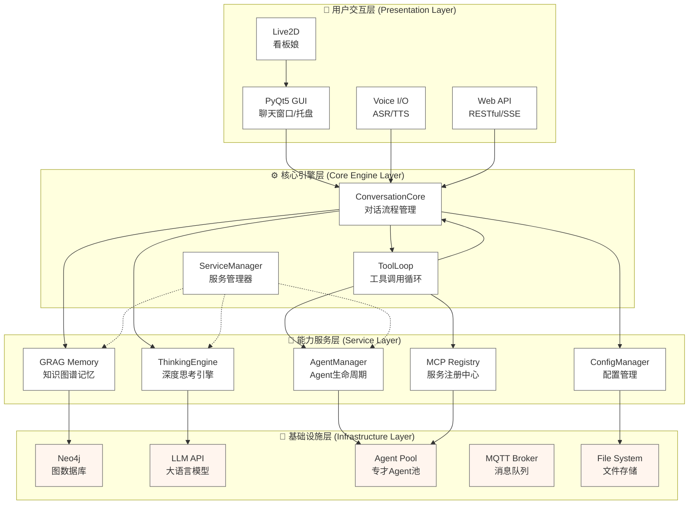
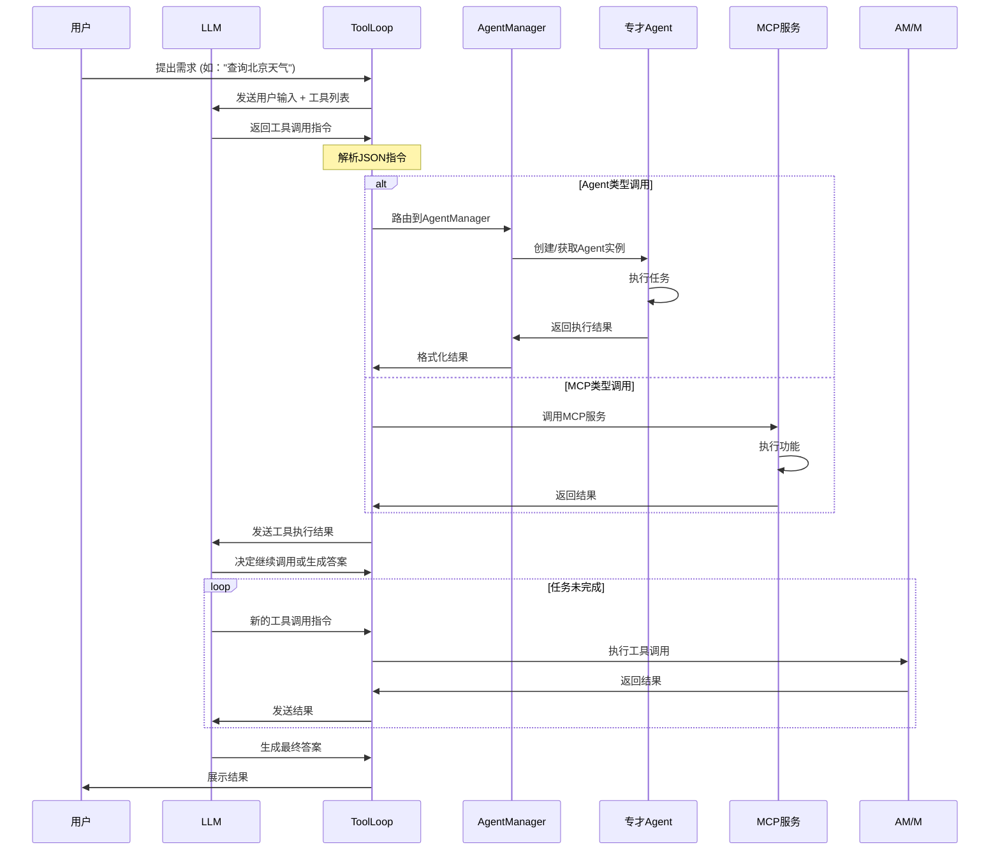
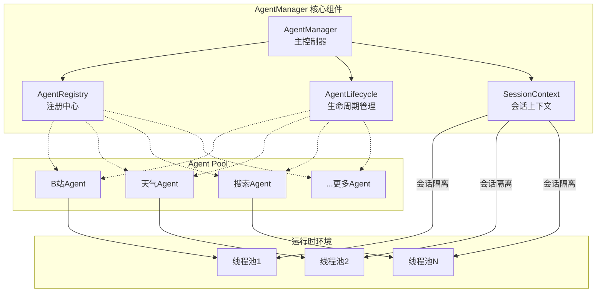

# NagaAgent 3.2.0

<div align="center">


</div>

---

#### 🎬 快速入门视频教程

[](https://www.pylindex.top/naga/intro.mp4)

---

## 🌟 项目简介

**🐍 NagaAgent** - 新一代智能对话助手框架，集成深度思考引擎、GRAG知识图谱记忆系统、多Agent协作机制、语音交互和现代化图形界面。

**核心特性**：
- 🧠 **深度思考引擎** - 基于遗传算法的多路径并行思考
- 🌳 **GRAG知识图谱** - 基于Neo4j的长期记忆与关联推理
- 🤖 **多Agent协作** - 动态任务分配与专才Agent生态
- 🎤 **流式语音交互** - 低延迟ASR/TTS，自然对话体验
- 🖥️ **现代化UI** - PyQt5图形界面与Live2D看板娘
- 🌐 **RESTful API** - 完整的Web服务接口
- 🔌 **热插拔架构** - Agent动态发现与配置热更新

---
## 🚀 快速开始

### 📋 系统要求

- **操作系统**: Windows 10/11, macOS 10.15+, Linux
- **Python**: 3.11 - 3.12
- **Docker**: 用于运行Neo4j数据库 (推荐)
- **硬件**: 建议 4GB+ 内存, 2GB+ 可用磁盘空间
- **网络**: 稳定的互联网连接 (用于LLM API调用)

### 🔧 安装步骤

#### 1. 克隆项目
```bash
git clone https://github.com/Xxiii8322766509/NagaAgent.git
cd NagaAgent
```

#### 2. 环境配置

<details>
<summary><strong>🪟 Windows 用户</strong></summary>

使用管理员权限运行PowerShell，执行一键配置脚本：
```powershell
.\setup.ps1
```
该脚本会自动：
- 创建Python虚拟环境
- 安装所有依赖包
- 配置环境变量
</details>

<details>
<summary><strong>🍎 macOS / 🐧 Linux 用户</strong></summary>

```bash
# 使用 uv (推荐，更快)
uv sync

# 或使用传统方式
python -m venv venv
source venv/bin/activate  # Linux/macOS
pip install -r requirements.txt
```
</details>


<details>
<summary><strong>手动配置</strong></summary>

```bash
# 使用 uv 安装依赖（推荐）
uv sync

# 或使用传统方式安装
# Linux/macOS
python -m venv .venv && source .venv/bin/activate && pip install -r requirements.txt

# Windows
python -m venv .venv && .\.venv\Scripts\activate && pip install -r requirements.txt

# 启动应用
uv run main.py
# 或
python main.py
```

</details>
<details>
<summary><strong>问题解决</strong></summary>

Windows下如果安装依赖时出现编译错误，请安装 Visual Studio 并勾选 "C++ 桌面开发"，然后使用 "Visual Studio Developer Shell (x64 Native)" 重新运行。

Linux/Mac 下请安装 gcc。

</details>

#### 3. 启动Neo4j数据库

```bash
docker run -d \
  --name naga-neo4j \
  --restart always \
  --publish=7474:7474 \
  --publish=7687:7687 \
  --env NEO4J_AUTH=neo4j/your_password \
  --volume neo4j_data:/data \
  neo4j:latest
```

**配置说明**：
- `your_password`: 替换为您的强密码
- `7474`: Web管理界面端口 (http://localhost:7474)
- `7687`: Bolt驱动程序端口
- `neo4j_data`: 数据持久化目录

### ⚙️ 配置文件

#### 1. 创建配置文件
```bash
cp config.json.example config.json
```

#### 2. 编辑配置项
打开 `config.json`，至少需要配置以下核心项：

```json
{
  "api": {
    "api_key": "your-llm-api-key",
    "base_url": "https://your-llm-provider/v1",
    "model": "your-model-name"
  },
  "grag": {
    "neo4j_password": "your-neo4j-password"
  }
}
```

**必填配置**：
- `api.api_key`: LLM服务API密钥
- `api.base_url`: LLM服务地址
- `api.model`: 使用的模型名称
- `grag.neo4j_password`: Neo4j数据库密码

**可选配置**：
```json
{
  "api": {
    "max_tokens": 4096,
    "temperature": 0.7,
    "timeout": 30
  },
  "grag": {
    "neo4j_uri": "bolt://localhost:7687",
    "neo4j_username": "neo4j",
    "enable_visualization": true
  },
  "voice": {
    "enabled": true,
    "asr_engine": "whisper",
    "tts_engine": "edge-tts"
  },
  "ui": {
    "theme": "dark",
    "live2d_enabled": true,
    "font_size": 14
  },
  "server": {
    "host": "0.0.0.0",
    "port": 8000,
    "enable_cors": true
  }
}
```

**配置说明**：
- `api.max_tokens`: 单次生成的最大token数量
- `api.temperature`: 生成随机性（0-1）
- `grag.neo4j_uri`: Neo4j连接地址
- `voice.enabled`: 是否启用语音功能
- `ui.theme`: 界面主题（light/dark）
- `server.port`: API服务端口

### 🚀 启动应用

#### Windows
```batch
# 带系统托盘启动（推荐）
start_with_tray.bat

# 或直接启动
python main.py
```

#### macOS / Linux
```bash
# 使用启动脚本
./start.sh

# 或直接运行
python main.py
```

启动成功后，您将看到：
1. 系统托盘图标（Windows）
2. PyQt5聊天窗口
3. API服务器（默认 http://localhost:8000）
4. 语音服务（如已启用）

### 🌐 Web界面
访问 http://localhost:8000/docs 查看API文档


---

## 🌟 核心功能详解

### 🧠 智能思考系统

#### 深度思考引擎 (`thinking/`)
- **多路径并行思考**: 自动生成逻辑、创新、分析、批判等多种思考分支
- **遗传算法优化**: 模拟生物进化过程，通过评估、交叉、变异筛选最优解
- **动态难度评估**: 根据问题复杂度自动调整思考深度
- **偏好学习**: 记忆用户偏好，个性化思考风格

#### GRAG知识图谱记忆 (`summer_memory/`)
- **五元组提取**: 将对话抽象为(主语, 谓语, 宾语, 时间, 属性)结构
- **关联推理**: 基于图数据库实现知识间的关联发现
- **智能召回**: 根据上下文动态检索相关记忆
- **可视化支持**: 生成知识图谱可视化图表

### 🤖 Agent生态系统

#### 专才Agent家族
- **📺 B站视频Agent**: 获取视频信息、播放量、评论等
- **🌤️ 天气时间Agent**: 实时天气查询和时间服务
- **📱 应用启动器**: 快速启动本地应用程序
- **🌐 网页爬取Agent**: 智能网页内容提取
- **📚 漫画下载Agent**: 批量下载漫画资源
- **🔍 在线搜索Agent**: 多引擎搜索整合
- **🎭 Playwright自动化**: 浏览器自动化操作
- **💬 记忆管理Agent**: 专门的记忆操作工具
- **📡 MQTT通信**: 物联网设备集成

#### Agent管理器 (`mcpserver/agent_manager.py`)
- **生命周期管理**: Agent的创建、调用、销毁全流程
- **会话隔离**: 独立的上下文环境，避免任务干扰
- **动态注册**: 扫描`agent-manifest.json`自动发现新Agent
- **负载均衡**: 智能分配任务到可用Agent

### 🎨 用户交互体验

#### PyQt5图形界面 (`ui/`)
- **现代化设计**: 采用QSS样式表，支持主题切换
- **消息渲染器**: 支持Markdown、代码高亮、LaTeX公式
- **实时流式输出**: 打字机效果展示AI回复
- **快捷操作**: 快捷键支持、历史记录搜索

#### Live2D看板娘 (`ui/live2d/`)
- **丰富动画**: 眨眼、呼吸、鼠标跟随等自然动作
- **模型切换**: 支持多个Live2D模型动态切换
- **智能回退**: 环境不支持时自动降级为静态图片
- **触摸交互**: 支持鼠标点击互动

#### 语音交互 (`voice/`)
- **流式ASR**: 边说边识别，低延迟语音输入
- **智能TTS**: 边生成边播放，自然的语音输出
- **语音引擎集成**: 支持多种TTS服务
- **降噪处理**: 环境噪音过滤，提升识别准确率

### 🔧 系统架构特性

#### 微服务设计
- **ServiceManager**: 统一的后台服务管理
- **异步架构**: 基于AsyncIO的高性能处理
- **容错机制**: 服务崩溃自动恢复
- **资源管理**: 智能的线程池和连接池

#### 配置管理
- **热更新支持**: 配置修改即时生效
- **多层配置**: 系统级、用户级、会话级配置
- **配置验证**: 启动时自动检查配置有效性
- **环境变量**: 支持通过环境变量覆盖配置

#### API服务 (`apiserver/`)
- **RESTful接口**: 完整的Web API
- **流式支持**: Server-Sent Events流式响应
- **自动文档**: Swagger/OpenAPI文档生成
- **认证安全**: API密钥认证机制

---

## 🏗️ 技术架构详解

### 分层架构设计

NagaAgent采用四层架构，实现高内聚、低耦合的模块化设计：

<div align="center">


</div>

### 各层职责详解

#### 🎨 用户交互层
- **PyQt5 GUI**: 提供完整的桌面应用体验
  - 主聊天窗口：支持Markdown、代码高亮
  - 系统托盘：后台运行，快速访问
  - 设置面板：配置管理，主题切换

- **Voice I/O**: 流式语音交互
  - ASR模块：实时语音识别
  - TTS模块：自然语音合成
  - 音频处理：降噪、音量控制

- **Web API**: 标准化接口
  - RESTful API：常规请求处理
  - SSE流式API：实时响应
  - 自动文档：Swagger/OpenAPI

#### ⚙️ 核心引擎层
- **ConversationCore**: 对话流程中枢
  - 会话管理：创建、维护、结束会话
  - 消息路由：用户输入到各模块的调度
  - 上下文维护：对话历史的持久化

- **ToolLoop**: 工具调用引擎
  - 指令解析：解析LLM生成的工具调用
  - 任务分发：将任务路由到对应Agent
  - 结果整合：多工具调用结果融合

- **ServiceManager**: 后台服务管理
  - 服务启动：API服务、语音服务等
  - 生命周期监控：服务健康检查
  - 资源管理：线程池、连接池管理

#### 🧠 能力服务层
- **ThinkingEngine**: 深度思考能力
  - 思考树生成：多路径思考分支
  - 遗传算法：思考路径优化
  - 结果融合：多分支思考结果整合

- **GRAG Memory**: 长期记忆系统
  - 五元组提取：结构化知识抽取
  - 图谱存储：Neo4j知识图谱构建
  - 智能检索：基于相似度的记忆召回

- **AgentManager**: Agent管理中心
  - Agent注册：动态发现和注册
  - 会话隔离：独立上下文环境
  - 任务调度：负载均衡和任务分配

#### 🔧 基础设施层
- **Neo4j**: 图数据库服务
  - 知识存储：实体和关系持久化
  - 图查询：Cypher查询支持
  - 可视化：Web管理界面

- **LLM API**: 大语言模型接口
  - 多模型支持：OpenAI、本地模型等
  - 流式生成：实时token输出
  - 配置管理：模型参数调整

- **Agent Pool**: 专才Agent集合
  - 垂直领域Agent：视频、天气、搜索等
  - 工具集成：浏览器、文件系统等
  - 第三方扩展：自定义Agent支持

---

## 📁 项目结构详解

```
NagaAgent/
├── 🚀 核心入口
│   ├── main.py                     # 主程序入口，ServiceManager服务管理
│   ├── pyproject.toml              # 项目配置与依赖管理 (PEP 621)
│   ├── requirements.txt            # 依赖包列表
│   └── config.json.example         # 配置文件模板
│
├── 📁 system/                     # 核心系统模块
│   ├── conversation_core.py        # 对话流程核心，管理整个对话生命周期
│   ├── config.py                   # 配置管理，支持热更新
│   ├── config_manager.py           # 配置热更新管理器
│   └── system_checker.py           # 系统环境自检功能
│
├── 📁 apiserver/                  # 🌐 API服务器 (FastAPI)
│   ├── api_server.py               # FastAPI应用主入口
│   ├── tool_call_utils.py          # 工具调用工具函数
│   ├── message_manager.py          # 消息管理器
│   └── prompt_logger.py            # 提示词日志记录
│
├── 📁 ui/                         # 🖥️ 用户界面 (PyQt5)
│   ├── pyqt_chat_window.py         # PyQt5主聊天窗口
│   ├── message_renderer.py         # 消息渲染器，支持Markdown/代码
│   ├── live2d/                     # Live2D看板娘模块
│   │   ├── live2d_manager.py       # Live2D管理器
│   │   └── live2d_models/          # Live2D模型文件
│   ├── tray/                       # 系统托盘功能
│   │   ├── console_tray.py         # 控制台托盘
│   │   └── system_tray.py          # 系统托盘
│   └── styles/                     # 界面样式文件
│
├── 📁 voice/                      # 🎤 语音交互模块
│   ├── start_voice_service.py      # 语音服务启动器
│   ├── input/                      # 语音输入 (ASR)
│   │   └── asr_manager.py         # ASR管理器
│   └── output/                     # 语音输出 (TTS)
│       └── tts_manager.py         # TTS管理器
│
├── 📁 summer_memory/              # 🧠 GRAG知识图谱记忆系统
│   ├── memory_manager.py           # 记忆管理器
│   ├── quintuple_extractor.py      # 五元组知识提取
│   ├── quintuple_graph.py          # Neo4j图操作
│   ├── quintuple_rag_query.py      # 知识检索查询
│   ├── task_manager.py             # 异步任务管理器
│   ├── visualize.py                # 知识图谱可视化
│   └── quintuple_visualize.py      # 五元组可视化工具
│
├── 📁 thinking/                   # 🌳 深度思考引擎
│   ├── tree_thinking.py            # 树状思考核心引擎
│   ├── genetic_pruning.py          # 遗传算法剪枝优化
│   ├── difficulty_judge.py         # 问题难度评估
│   ├── preference_filter.py        # 用户偏好过滤
│   ├── thinking_node.py            # 思考节点管理
│   └── thread_pools.py             # 线程池并发调度
│
├── 📁 mcpserver/                  # 🛠️ Agent与MCP服务管理
│   ├── agent_manager.py            # Agent生命周期管理
│   ├── mcp_registry.py             # MCP服务注册中心
│   ├── mcp_manager.py              # MCP工具管理器
│   │
│   ├── 🤖 专才Agent家族
│   ├── agent_bilibili_video/       # B站视频信息Agent
│   │   ├── agent_bilibili_video.py
│   │   └── agent-manifest.json
│   ├── agent_weather_time/         # 天气时间Agent
│   ├── agent_open_launcher/        # 应用启动器Agent
│   ├── agent_crawl4ai/             # 网页爬取Agent
│   ├── agent_comic_downloader/     # 漫画下载Agent
│   ├── agent_memory/               # 记忆管理Agent
│   ├── agent_mqtt_tool/            # MQTT通信Agent
│   ├── agent_naga_portal/          # 门户登录Agent
│   ├── agent_online_search/        # 在线搜索Agent
│   ├── agent_playwright_master/    # Playwright自动化Agent
│   └── ...
│
├── 📁 mqtt_tool/                  # 📡 MQTT物联网工具
│   ├── mqtt_client.py              # MQTT客户端
│   ├── mqtt_manager.py             # MQTT管理器
│   └── device_manager.py           # 设备管理器
│
├── 📁 game/                       # 🎮 游戏化交互模块 (开发中)
│   ├── game_manager.py             # 游戏管理器
│   └── achievements/               # 成就系统
│
├── 📁 logs/                       # 📝 日志管理
│   ├── logger.py                   # 日志配置
│   └── log_rotator.py              # 日志轮转
│
└── 📁 data/                       # 💾 数据存储
    ├── conversations/              # 对话历史
    ├── memories/                   # 记忆数据
    └── cache/                      # 缓存文件
```

### 关键模块说明

#### 🔧 核心系统 (`system/`)
- **ServiceManager**: 统一管理所有后台服务，支持异步操作
- **ConversationCore**: 整个应用的中枢，协调各模块工作
- **ConfigManager**: 实现配置热更新，无需重启即可生效

#### 🧠 记忆系统 (`summer_memory/`)
- **五元组模型**: (主语, 谓语, 宾语, 时间, 属性)的知识表示
- **异步任务**: 支持记忆的异步提取和存储
- **可视化工具**: 生成知识图谱的交互式图表

#### 🤖 Agent 架构 (`mcpserver/`)
- **Manifest机制**: 通过JSON文件定义Agent能力
- **动态注册**: 运行时自动发现新Agent
- **统一接口**: 所有Agent遵循统一的调用协议

---

## 🔧 工具调用循环机制

### Tool Loop 工作流程

NagaAgent的工具调用系统是其核心能力，允许LLM动态调用外部工具完成复杂任务：

<div align="center">


</div>

### 调用协议示例

#### 1. LLM生成的工具调用指令
```json
{
  "tool_calls": [
    {
      "type": "function",
      "function": {
        "name": "get_weather",
        "arguments": "{\"city\": \"北京\", \"agentType\": \"agent\"}"
      }
    }
  ]
}
```

#### 2. ToolLoop解析和路由
- **agentType**: `agent` 或 `mcp`
- **工具名称**: 对应Agent或MCP服务
- **参数**: JSON格式的参数对象

#### 3. Agent执行流程
```python
# AgentManager处理流程
async def handle_agent_call(tool_name, params):
    # 1. 获取或创建Agent实例
    agent = await get_agent(tool_name)

    # 2. 执行任务
    result = await agent.execute(params)

    # 3. 格式化返回
    return format_agent_result(result)
```

#### 4. 结果融合策略
- **单工具结果**: 直接展示
- **多工具结果**: 智能整合相关信息
- **错误处理**: 优雅降级，提供备选方案

### 循环控制机制

- **最大循环次数**: 防止无限循环 (默认5次)
- **超时控制**: 单次工具调用超时限制
- **错误恢复**: 工具调用失败时的重试机制
- **上下文管理**: 维护工具调用的上下文状态

---

## 🤖 AgentManager 系统详解

### Agent管理架构

AgentManager是NagaAgent的核心组件，负责管理和协调整个Agent生态系统：

<div align="center">


</div>

### 核心功能

#### 1. 动态注册机制
```python
# Agent发现流程
async def discover_agents():
    # 扫描mcpserver目录
    for agent_dir in list_agents():
        manifest_path = f"{agent_dir}/agent-manifest.json"
        manifest = load_manifest(manifest_path)

        # 注册Agent
        await registry.register(
            name=manifest.name,
            entry_point=manifest.entry_point,
            capabilities=manifest.capabilities
        )
```

#### 2. 生命周期管理
- **创建**: 根据manifest动态实例化Agent
- **初始化**: 调用Agent的初始化方法
- **激活**: 将Agent放入就绪队列
- **调用**: 分配任务给Agent执行
- **休眠**: 空闲时降低资源占用
- **销毁**: 清理资源，释放内存

#### 3. 会话隔离策略
- **独立上下文**: 每个会话拥有独立的变量空间
- **状态隔离**: Agent状态不会跨会话泄露
- **资源隔离**: 防止资源竞争和死锁
- **安全隔离**: 限制Agent的访问权限

#### 4. 智能调度算法
```python
async def schedule_task(task):
    # 1. 匹配Agent能力
    capable_agents = find_agents_by_capability(task.required_capabilities)

    # 2. 负载均衡
    selected_agent = load_balance(capable_agents)

    # 3. 任务分发
    result = await selected_agent.execute(task)

    # 4. 结果收集
    return process_result(result)
```

### Agent规范

#### Manifest文件格式
```json
{
  "name": "WeatherAgent",
  "version": "1.0.0",
  "description": "天气查询服务",
  "entryPoint": {
    "module": "mcpserver.agent_weather.weather_agent",
    "class": "WeatherAgent"
  },
  "capabilities": {
    "get_weather": {
      "description": "获取指定城市的天气信息",
      "parameters": ["city", "date"]
    }
  },
  "dependencies": ["requests", "pytz"],
  "timeout": 10000
}
```

#### Agent接口规范
```python
class BaseAgent:
    async def initialize(self, config):
        """初始化Agent"""
        pass

    async def execute(self, tool_name, params):
        """执行工具调用"""
        pass

    async def cleanup(self):
        """清理资源"""
        pass

    def get_capabilities(self):
        """返回能力列表"""
        pass
```

### 高级特性

#### 1. 热插拔支持
- 动态加载新Agent，无需重启
- 实时更新Agent配置
- 优雅停机和重启

#### 2. 监控和诊断
- Agent健康检查
- 性能指标收集
- 调用链追踪
- 错误日志记录

#### 3. 扩展机制
- 自定义调度策略
- 插件式中间件
- 事件驱动架构
- 分布式部署支持

---

## 🤝 贡献指南

我们热烈欢迎社区的任何形式的贡献！

### 🐛 报告问题
- 使用 [GitHub Issues](https://github.com/Xxiii8322766509/NagaAgent/issues) 报告Bug
- 请提供详细的复现步骤和环境信息
- 使用模板提交，包含必要的日志和截图

### 💡 功能建议
- 在 [GitHub Discussions](https://github.com/Xxiii8322766509/NagaAgent/discussions) 中讨论新功能
- 加入 [QQ交流群](https://qm.qq.com/q/kbN6iLroME) 参与实时讨论

### 📝 贡献代码

#### 开发环境设置
```bash
# 1. Fork并克隆项目
git clone https://github.com/YOUR_USERNAME/NagaAgent.git
cd NagaAgent

# 2. 创建开发分支
git checkout -b your-branch-name

# 3. 安装开发依赖
uv sync
```

#### 提交PR
1. 确保代码通过所有测试
2. 更新相关文档
3. 编写清晰的提交信息
4. 确保可以在全新环境运行

---

## 📄 许可证

本项目采用 MIT 许可证。详情请参阅 [LICENSE](LICENSE) 文件。

---

## 🙏 致谢

感谢所有为NagaAgent项目做出贡献的开发者和社区成员！

特别感谢：
- Neo4j 提供优秀的图数据库
- PyQt5 社区提供的GUI框架
- 所有开源依赖库的作者

---

<div align="center">

**⭐ 如果这个项目对您有帮助，请不吝给我们一个 Star！ ⭐**

[](https://github.com/Xxiii8322766509/NagaAgent)

</div>
