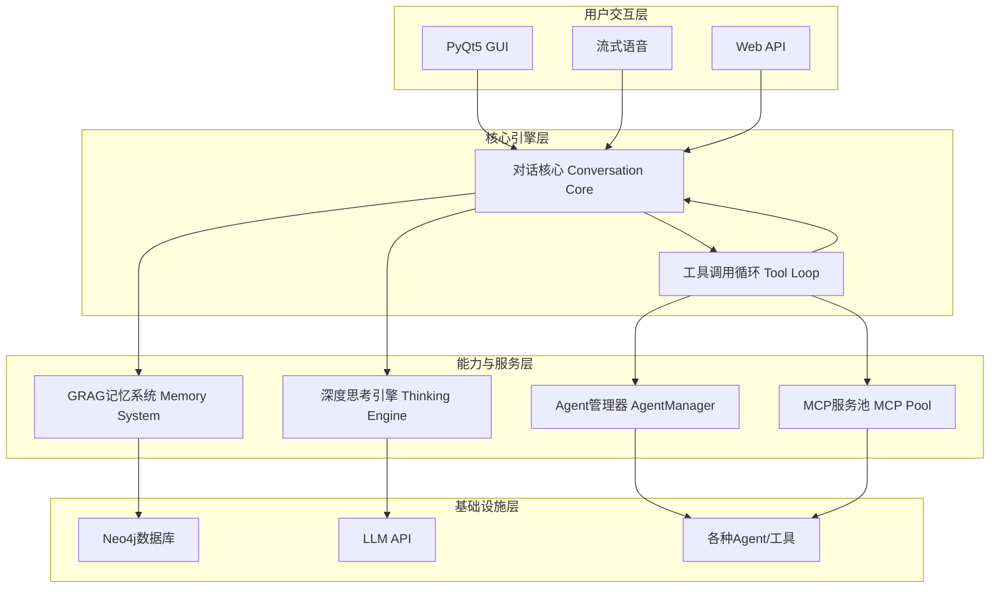

# NagaAgent 3.2


---

#### 快速入门跟随操作参考视频

**[https://www.pylindex.top/naga/intro.mp4](https://www.pylindex.top/naga/intro.mp4)**

---

**🐍 一个高度可扩展、具备深度思考和长期记忆能力的本地化AI Agent框架**

**NagaAgent** 是一个功能强大的智能对话助手，围绕模块化、可扩展性和智能化进行设计。它不仅仅是一个聊天机器人，更是一个集成了高级记忆系统、动态工具调用、多模态交互和深度思考能力的综合性AI框架。

---
## 🚀 快速开始

### 📋 系统要求

- **操作系统**: Windows 10/11, macOS 10.15+, or Linux
- **Python**: 3.11 或 3.12
- **Docker**: 用于运行Neo4j数据库 (推荐)
- **硬件**: 建议 4GB 以上内存, 2GB 以上可用磁盘空间

### 🔧 安装步骤

1.  **克隆项目**
    ```bash
    git clone https://github.com/Xxiii8322766509/NagaAgent.git
    cd NagaAgent
    ```

2.  **配置环境 (三选一)**

    <details>
    <summary><strong>Windows 用户</strong></summary>
    
    使用管理员权限运行PowerShell，执行一键配置脚本。它将帮助您创建虚拟环境并安装依赖。
    ```powershell
    .\setup.ps1
    ```
    </details>

    <details>
    <summary><strong>macOS / Linux 用户</strong></summary>
    
    执行以下命令创建虚拟环境并激活，然后安装依赖。
    ```bash
    # 安装依赖
    # 可选：安装uv
    uv sync
    
    # 或者使用pip
    pip install -r requirements.txt
    ```
    
    </details>
    
3.  **启动记忆数据库 (Neo4j)**

    NagaAgent使用Neo4j作为知识图谱数据库。我们强烈建议使用Docker来运行它，这是最简单的方式。

    ```bash
    docker run -d --name naga-neo4j  --restart always --publish=7474:7474 --publish=7687:7687 --env NEO4J_AUTH=neo4j/your_password --volume=neo4j_data:/data neo4j:latest
    ```
    - **neo4j_data**: 替换为你的数据存储目录
    - **NEOJ4_AUTH**: 请务必将 `your_password` 替换为您自己的强密码。
    - **端口**: `7474`是Web管理界面端口，`7687`是Bolt驱动程序端口。

### ⚙️ 配置说明

1.  **创建配置文件**
    从模板文件复制一份配置文件。
    ```bash
    cp config.json.example config.json
    ```

2.  **编辑配置文件**
    打开 `config.json` 并填入必要的密钥和参数：
    - `api`: 至少需要填写 `api_key` 、 `base_url`和`model_name`。
    - `grag`: 填写您在启动Neo4j时设置的 `neo4j_password`。
    - 其他配置项可以暂时保持默认。

### 🚀 启动应用

- **Windows**:
  - `start_with_tray.bat`: 启动应用并自动隐藏到系统托盘。
- **macOS / Linux**:
  - `./start.sh`

启动后，您将看到NagaAgent的主界面，并可以开始对话了！


---

## 🌟 核心功能

### 智能与记忆

- **🌳 深度思考引擎**:
  - **多分支并行思考**: 面对复杂问题，能自动生成逻辑、创新、分析等多种思考路径。
  - **遗传算法剪枝**: 通过模拟生物进化过程，对思考路径进行评估、交叉与变异，最终融合出最优答案。
- **🧠 GRAG 知识图谱记忆**:
  - **长期记忆**: 基于Neo4j图数据库，将对话信息抽象为“五元组”并构建知识网络，实现真正的长期记忆和关联推理。
  - **上下文智能召回**: 根据当前对话，动态从知识图谱中检索最相关的记忆片段，让对话更有深度和连续性。
- **🤖 多Agent协作**:
  - **独立的AgentManager**: 负责Agent的生命周期管理、任务分发和会话隔离，支持复杂的协同任务。
  - **动态任务分配**: 一个主Agent可以根据任务需求，将子任务智能地分配给专门的Agent（如浏览器Agent、文件Agent）处理。

### 扩展与集成

- **🔌 Agent热插拔与动态发现**:
  - 新增或修改一个Agent，只需添加或更新其`agent-manifest.json`文件，系统即可自动发现并注册，无需重启。
- **🔧 统一的工具调用 (MCP)**:
  - 无论是内部服务还是外部Agent，都遵循统一的工具调用协议，简化了LLM的指令生成和系统的任务路由。
- **🌐 完整的RESTful API**:
  - 通过FastAPI提供了一整套API，包括流式和非流式对话接口，并自动生成Swagger文档，方便第三方应用集成。
- **📡 MQTT 通信**:
  - 内置MQTT工具，可以轻松实现与物联网（IoT）设备的联动，将Agent能力扩展到智能家居等物理世界场景。

### 用户体验

- **🖥️ 现代化图形界面**:
  - 基于PyQt5构建，提供美观、响应迅速的聊天窗口。
  - **消息渲染**: 模块化的消息渲染器，支持Markdown、代码高亮和工具调用结果的特殊展示。
- **🎭 Live2D 看板娘**:
  - 集成独立的Live2D模块，支持丰富的动画（如眨眼、呼吸、鼠标跟随）和模型切换，交互过程不再单调。
  - **智能回退**: 在不支持的环境下，可自动切换为静态图片。
- **🎤 流式语音交互**:
  - **边说边识别，边生成边播放**: 实现了低延迟的流式ASR和TTS，提供流畅的语音对话体验。
  - **智能分句**: 优化语音输出，确保在合适的断点处停顿，使语音听起来更自然。
- **📱 系统托盘与自启动**:
  - 支持将应用最小化到系统托盘，在后台静默运行。
  - 可配置开机自启动，方便日常使用。

### 系统与架构

- **🔄 配置热更新**:
  - 修改`config.json`文件后，相关模块的配置可立即生效，无需重启整个应用，极大提升了开发和调试效率。
- **🔧 系统环境自检**:
  - 启动时自动检测Python版本、依赖库、配置文件等，并提供明确的修复建议，降低了首次部署的难度。
- **💾 持久化上下文**:
  - 即使重启应用，也能自动加载最近的对话历史，保持对话的连续性。

---

## 🌟 核心功能

### 智能与记忆

- **🌳 深度思考引擎**:
  - **多分支并行思考**: 面对复杂问题，能自动生成逻辑、创新、分析等多种思考路径。
  - **遗传算法剪枝**: 通过模拟生物进化过程，对思考路径进行评估、交叉与变异，最终融合出最优答案。
- **🧠 GRAG 知识图谱记忆**:
  - **长期记忆**: 基于Neo4j图数据库，将对话信息抽象为“五元组”并构建知识网络，实现真正的长期记忆和关联推理。
  - **上下文智能召回**: 根据当前对话，动态从知识图谱中检索最相关的记忆片段，让对话更有深度和连续性。
- **🤖 多Agent协作**:
  - **独立的AgentManager**: 负责Agent的生命周期管理、任务分发和会话隔离，支持复杂的协同任务。
  - **动态任务分配**: 一个主Agent可以根据任务需求，将子任务智能地分配给专门的Agent（如浏览器Agent、文件Agent）处理。

### 扩展与集成

- **🔌 Agent热插拔与动态发现**:
  - 新增或修改一个Agent，只需添加或更新其`agent-manifest.json`文件，系统即可自动发现并注册，无需重启。
- **🔧 统一的工具调用 (MCP)**:
  - 无论是内部服务还是外部Agent，都遵循统一的工具调用协议，简化了LLM的指令生成和系统的任务路由。
- **🌐 完整的RESTful API**:
  - 通过FastAPI提供了一整套API，包括流式和非流式对话接口，并自动生成Swagger文档，方便第三方应用集成。
- **📡 MQTT 通信**:
  - 内置MQTT工具，可以轻松实现与物联网（IoT）设备的联动，将Agent能力扩展到智能家居等物理世界场景。

### 用户体验

- **🖥️ 现代化图形界面**:
  - 基于PyQt5构建，提供美观、响应迅速的聊天窗口。
  - **消息渲染**: 模块化的消息渲染器，支持Markdown、代码高亮和工具调用结果的特殊展示。
- **🎭 Live2D 看板娘**:
  - 集成独立的Live2D模块，支持丰富的动画（如眨眼、呼吸、鼠标跟随）和模型切换，交互过程不再单调。
  - **智能回退**: 在不支持的环境下，可自动切换为静态图片。
- **🎤 流式语音交互**:
  - **边说边识别，边生成边播放**: 实现了低延迟的流式ASR和TTS，提供流畅的语音对话体验。
  - **智能分句**: 优化语音输出，确保在合适的断点处停顿，使语音听起来更自然。
- **📱 系统托盘与自启动**:
  - 支持将应用最小化到系统托盘，在后台静默运行。
  - 可配置开机自启动，方便日常使用。

### 系统与架构

- **🔄 配置热更新**:
  - 修改`config.json`文件后，相关模块的配置可立即生效，无需重启整个应用，极大提升了开发和调试效率。
- **🔧 系统环境自检**:
  - 启动时自动检测Python版本、依赖库、配置文件等，并提供明确的修复建议，降低了首次部署的难度。
- **💾 持久化上下文**:
  - 即使重启应用，也能自动加载最近的对话历史，保持对话的连续性。

---

## 🏗️ 技术架构

NagaAgent采用分层、模块化的架构，确保了系统的高内聚、低耦合。

<div align="center">


</div>

- **用户交互层**: 负责接收用户输入并展示输出，支持GUI、语音、API等多种形式。
- **核心引擎层**: `Conversation Core`是整个应用的中枢，负责管理对话流程。`Tool Loop`则专门处理与LLM的工具调用交互。
- **能力与服务层**: 提供Agent的核心能力，如思考、记忆和工具管理。`AgentManager`和`MCP Pool`是系统可扩展性的关键。
- **基础设施层**: 为上层提供支持的底层服务，如数据库、大语言模型和具体的执行工具。

---

## 📁 项目结构

```
NagaAgent/
├── 📄 main.py                     # 🚀 主程序入口
├── 📄 pyproject.toml              # 📦 项目配置与依赖管理 (PEP 621)
├── 📄 config.json.example         # ⚙️ 配置文件模板
├── 📁 system/                     # 核心系统模块
│   ├── conversation_core.py        #   - 对话流程核心
│   ├── config_manager.py           #   - 配置热更新管理器
│   └── system_checker.py           #   - 系统环境自检
├── 📁 apiserver/                  # 🌐 API服务器 (FastAPI)
│   └── api_server.py               #   - API路由定义
├── 📁 ui/                         # 🖥️ 用户界面 (PyQt5)
│   ├── pyqt_chat_window.py         #   - 主聊天窗口
│   ├── message_renderer.py         #   - 消息渲染与格式化
│   ├── live2d/                     #   - Live2D看板娘模块
│   └── tray/                       #   - 系统托盘模块
├── 📁 voice/                      # 🎤 语音交互模块
│   ├── input/                      #   - 语音输入 (ASR)
│   └── output/                     #   - 语音输出 (TTS)
├── 📁 summer_memory/              # 🧠 GRAG记忆系统
│   ├── memory_manager.py           #   - 记忆的存取与管理
│   ├── quintuple_extractor.py      #   - 对话信息五元组提取
│   └── quintuple_graph.py          #   - Neo4j图操作
├── 📁 thinking/                   # 🌳 深度思考引擎
│   ├── tree_thinking.py            #   - 思考树主逻辑
│   └── genetic_pruning.py          #   - 遗传算法剪枝
├── 📁 mcpserver/                  # 🛠️ Agent与MCP服务
│   ├── agent_manager.py            #   - Agent生命周期管理
│   ├── mcp_registry.py             #   - Agent/服务动态注册
│   └── agent_*/                    #   - 具体的Agent实现
├── 📁 game/                       # 🎮 游戏化交互模块 (探索中)
├── 📁 mqtt_tool/                  # 📡 MQTT物联网工具
└── 📁 logs/                       # 📝 日志文件
```

---

## 🔧 工具调用循环机制

NagaAgent的工具调用是其核心特色之一，它允许LLM通过调用外部工具来完成复杂任务。

1.  **LLM生成指令**: 当用户提出需要借助外部能力才能完成的需求时（如“今天天气怎么样？”），LLM会生成一个JSON格式的工具调用指令。
2.  **格式解析**: 系统解析该JSON，识别出需要调用的`agentType`（`mcp`或`agent`）、服务/Agent名称及所需参数。
3.  **任务路由**:
    - `mcp`类型请求被路由到 **MCPManager**，由其调用具体的功能服务（如文件操作）。
    - `agent`类型请求被路由到 **AgentManager**，由其唤醒对应的专才Agent执行任务。
4.  **结果返回**: 工具执行的结果被格式化后，返回给LLM。
5.  **循环或终结**: LLM根据执行结果，决定是继续调用其他工具，还是生成最终答案给用户。这个过程会循环进行，直到任务完成。

---

## 🤖 AgentManager 独立系统

AgentManager是NagaAgent的“大脑”之一，它赋予了系统管理和编排多个专才Agent的能力。

- **动态加载**: 从`mcpserver/`目录下的`agent-manifest.json`文件自动加载和注册Agent。
- **会话隔离**: 为每个用户或每个任务创建独立的会话上下文，确保多任务并行时互不干扰。
- **生命周期管理**: 负责Agent的初始化、调用、休眠和销毁。
- **智能提示词**: 支持在System Prompt中使用`{{...}}`占位符，动态插入Agent名称、当前时间、环境变量等信息，让提示词更加灵活和强大。

---

## 🤝 贡献指南

我们热烈欢迎来自社区的任何形式的贡献！

- **报告Bug**: 通过 [GitHub Issues](https://github.com/Xxiii8322766509/NagaAgent/issues) 提交您发现的问题。
- **提出建议**: 有任何新功能的想法，欢迎在 [GitHub Discussions](https://github.com/Xxiii8322766509/NagaAgent/discussions) 中分享。
- **贡献代码/文档**: Fork项目并提交Pull Request。请确保遵循项目已有的代码风格和规范。

---

## 📄 许可证

本项目采用 MIT 许可证。详情请参阅 [LICENSE](LICENSE) 文件。

<div align="center">

---

**⭐ 如果这个项目对您有帮助，请不吝给我们一个 Star！ ⭐**

</div>
